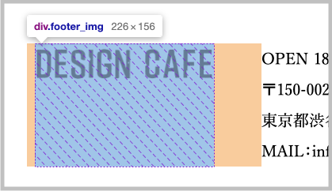
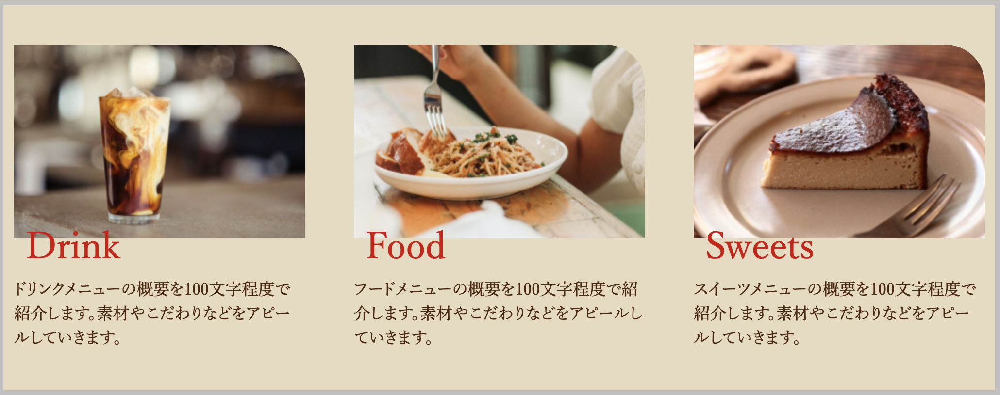

この２つは画面幅を変えた時に違いが出ます。

## 1. `width`を使用するケース

### ケース1｜画像の横幅



```html
<div class="footer_img">
  
</div>
```
  
```css
.footer_img {
  width: 226px;
}
```


### ケース2｜横並びレイアウトで構成比率を指定する



```html
<ul>
  <li>リスト1</li>
  <li>リスト2</li>
  <li>リスト3</li>
</ul>
```

```css
ul {
  display: flex;
  justify-content: space-between;
}
li {
  width: 30%
}
```

!!! point
    `px`で指定も可能ですが、レスポンシブに対応するために`%`で指定することが多いです。

## 2. `max-width`を使用するケース

### ケース｜コンテンツ幅の横幅

学び始めはこの使い方を最もよく目にします。

```html
<section id="about" class="section">
  （aboutセクションの中身）
</section>
```

```css
.section {
  max-width: 1200px;
  margin: 0 auto;
}
```

`max-width`を使うケースは他にもありますが、まずはコンテンツ幅での使われ方がわかっていればOKです。


## 3. 具体的な動きの違い

ここから確認できます。<br>
[https://yu-z.com/sample/02/](https://yu-z.com/sample/02/)